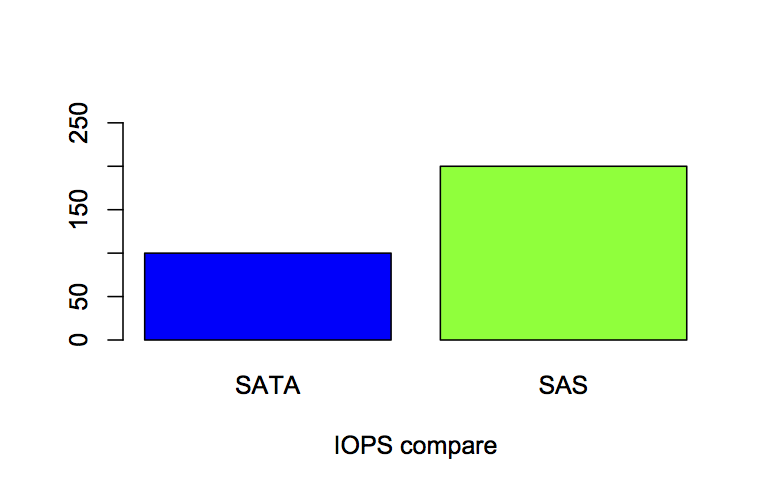

失敗から学ぶMySQLチューニング
-------------------------------------
----

..
    ----

    自己紹介
    --------

    * id: yuokada
    * `@uokada <https://twitter.com/#!/uokada>`_
    * 2009入社

    ----

概要
----

#. 本日のテーマ
#. 検証環境
#. MySQLのチューニング
#. Linuxカーネルのチューニング
#. ハードウェア選定
#. 測定
#. まとめ
#. あとがき

----

本日のテーマ
------------

前期実施したMySQLのチューニングのまとめ。

なんでこんなにハマったのか反省の意味でシェア。

..
  **「勝ちに不思議の勝ちあり 負けに不思議の負けなし。」**

  失敗から学び、次に生かしましょうという話です。

----

チューニング実施環境
--------------------
* MySQL5.1
* CentOS5.6
* Kernel 2.6.18

.. 
   2006年リリースのカーネル

----

MySQLのチューニング その1
-------------------------
InnoDBのチューニングでデフォルトから変更したパラメータをいくつか紹介。

#. **innodb_buffer_pool_size** ・・・ InnoDBのデータやIdxをキャッシュするメモリ領域

   InnoDBで一番重要な値。 搭載メモリの80%程度を設定するのがデフォルト

#. **innodb_log_file_size** ・・・ InnoDBの更新ログを記録するディスク上のログファイルのサイズ

   上限1GB程度で数百MBぐらいのサイズを割り当てるのがベター

   **大きくしすぎるとクラッシュリカバリの時間が長くなります**

----

MySQLのチューニング その2
-------------------------

- **innodb_flush_log_at_trx_commit**

  バッファに溜まったログをディクスにフラッシュするタイミングを指定するパラメータ

  デフォルト1だとコミットごとにフラッシュして非常に遅いのでアクティブマスター以外は0に設定するのがベター

- **sync_binlog** ・・・ バイナリログをディスクにフラッシュする方法を指定するパラメータ

  デフォルトは0。 MySQLではフラッシュさせずにOSに任せる設定。早い。
  
  1だとトランザクションごとにフラッシュする設定。遅い。

  マスターなら1、それ以外は0に設定するのが推奨
  
..
    - innodb_autoextend_increment

----

MySQLのチューニング その3
-------------------------

- query_cache_aize
- query_cache_type

クエリとその実行結果をキャッシュし、次回から同じ内容のクエリが要求された場合にキャッシュから結果を返すための設定

よっぽど更新がないテーブルでしか有効でない機能なので0に設定する

@ref: `DSAS開発者の部屋:クエリキャッシュは切ったほうがいいんじゃなイカ？ <http://dsas.blog.klab.org/archives/52021866.html>`_

----

Linuxのチューニング
-------------------
今回のチューニングではI/O周りのパラメータを2つ変更

永続化するには **/boot/grub/menu.lst** を編集

@ref: `ほえほえ LinuxファイルI/Oチューニング <http://haginov.blog35.fc2.com/blog-entry-45.html>`_

- nr_requests ・・・  I/O request queueの最大長を指定するパラメータ

  かなり大きくしても大丈夫。 デフォルトの数倍ぐらいでいいと思う。

- io_scheduler ・・・ I/Oデバイスのスケジューラを指定するパラメータ

  kernel2.6のデフォルトはcfq. DBはdeadlineに変更することを推奨。
  MyISAMでは有効だがInnoDBでは変更してもそれほど影響がないパラメータ

  **今回はdeadlineに変更しても効果が現れなかったのでcfqのまま**

----

パラメータの変更方法
--------------------

::

     #nr_requestsを2048に変更
     % cat /sys/block/hda/queue/nr_requests
     256
     % sudo sh -c 'cat 2048 > /sys/block/hda/queue/nr_requests
     % cat /sys/block/hda/queue/nr_requests
     2048

::

     #I/Oスケジューラをdeadlineに変更
     % cat /sys/block/hda/queue/scheduler
     noop anticipatory deadline [cfq]
     % sudo sh -c 'cat deadline > /sys/block/hda/queue/scheduler'
     % cat /sys/block/hda/queue/scheduler
     noop anticipatory [deadline] cfq

**再起動不要 変更した瞬間から値が反映される**

----

チューニングのまとめ
-------------------------
- 以上のチューニングをやったおかげでINSERTの性能が当初の3倍程度のパフォーマンスが出るようになりました。
- SELECTと組み合わせたテストは実施していないので本番でどこまでパフォーマンス落ちるのか不安
- 最初、スタンバイマスターもマスターと同じ設定にしたことで
  レプリケーションの遅延が激しかったのでその他のスレーブと設定を合わせることで遅延を解消させた

----

..
    ----

    ハードウェア選定
    ----------------
    * なぜここまでパフォーマンスが出ないのか??
      * 真剣に考えた結果見えたのはハードウェアが悪いってことでした。

    ----

    MySQLを使いこなすには
    ---------------------
    - 設計
        - 効率のいいデータ型の利用
        - PKにVARCHARで100文字異常使うとか論外
        - 複合カラムのPKもあまりオススメしない
        - PKが無いときはサロゲートキーを使いましょう

データベースのボトルネック
--------------------------
- 問題の大半はディスクI/O(IOPS)がボトルネック
    - IOPSは、ディスクが1秒当たりに処理できるI/Oアクセスの数
    - SSDを選ぶことで大半は解消される
- データがメモリに乗っている間はほとんどI/Oが発生しないので問題ないが

  データサイズがメモリからあふれるとディスクI/Oが発生し途端にパフォーマンスが悪化する

  - **メモリから溢れないように設計・選定することが大事**

.. 
    ----
    RANGEパーティションについて
    ---------------------------
    - RANGEパーティションが使える要件
        - INSERT主体のテーブル
        - SELECTも最新のデータへの参照しかしない
    - ex. ログテーブル
    - 巨大テーブルでインメモリでINSERTを完結させるための手法

    `ソーシャルゲームのためのデータベース設計 <http://www.slideshare.net/matsunobu/ss-6584540>`_

..
    ----
    IOPS
    ----
    .. list-table:: ハードウェアのIOPS比較表
       :widths: 90 90
       :header-rows: 1

       * - DISK
         - IOPS
       * - 7200rpm SATA
         - 100
       * - 15000 SAS
         - 200
       * - SSD(intel x-25)
         - about 8600

    ::

        hd <- c('SATA', 'SAS', 'SSD')
        iops <- c(100, 200, 6600)
        iops.names <- hd
        barplot(iops, names.arg=iops.names, col=c("blue", "green", "red", "yellow", "cyan"), ylim=c(0,500), xlab='IOPS compare')

    @ref: `IOPS - Wikipedia, the free encyclopedia <http://en.wikipedia.org/wiki/IOPS>`_

----

IOPSを比較したグラフ1
---------------------

----

IOPSを比較したグラフ2
---------------------

.. image:: IOPS-compare.png

@ref: `IOPS - Wikipedia, the free encyclopedia <http://en.wikipedia.org/wiki/IOPS>`_

----

まとめ
------
..
    * いいところよりも悪いところをチューニングで解消する

* チューニングは最後の付け足しです。    
* データベースのボトルネックの原因はたいていハードウェア
* MySQLはRDBMSです。 データを入れるための箱ではありません。
    * **正しい設計をして本来の用途で使いましょう！**

----

Link
----
**参考資料**

- `Linux/DB Tuning (DevSumi2010, Japanese) <http://www.slideshare.net/matsunobu/linuxdb>`_

..
    ----
    あとがき
    --------
    * 2年連続で同じ事やってます。
        * そろそろ、飽きましたね(´Д｀)
        * チューニング不要でまともに動くDBが使いたいです。

        `Apache CassandraとAmazon DynamoDBの比較 ｜ Classmethod.dev() <http://dev.classmethod.jp/cloud/apache-cassandra-and-amazon-dynamodb-compare/>`_

    * DBサーバーにおいてチューニングは大事な作業です。
        * ただし、ハードウェアの性能を使い切れてない場合に限る!!
        * IOPSを100％使い切っている環境でチューニングしても多少改善する程度で*ほとんど意味が無い*

    * vm.swappiness = 0

      vm.swappiness = 0 実メモリを使い切ったときに、ファイルシステムキャッシュを優先的に捨てて空きメモリを確保する プロセスサイズが実メモリを超えたら、プロセスがスワップされる
